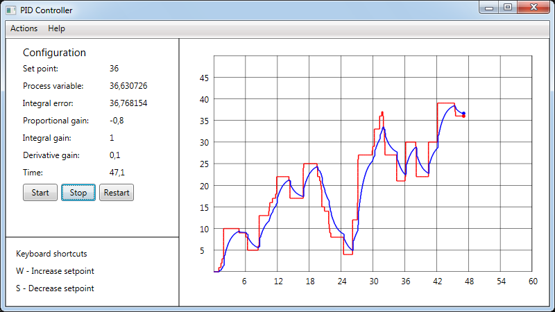

# PID-Controller-WPF

[English](README.md) | [Русский](README.ru.md)

`PID-Controller-WPF` is the project that involves creating a software application that provides a simulation environment for testing and optimizing PID controller parameters for various control systems.

## Overall description

This project is designed to simulate a **PID controller** in order to regulate *process variable* depending on *setpoint*. 

For example, if you need to ensure that the *real speed of a vehicle* is consistent with the value of a *desired speed*, then the application `PID-Controller-WPF` can be useful when selecting the parameters of the **PID controller**.

This app is written in `C#` programming language using **MVVM** pattern. 



### Goal

The goal of the project is to create a software application that simulates a PID controller to regulate a process variable depending on a setpoint.

### Scope

The scope of the project includes developing a WPF application in C# using the MVVM pattern to simulate a PID controller and allow for the selection of controller parameters for specific applications.

### Who can use this project

This project can be used by engineers, researchers, or anyone involved in process control and automation who needs to optimize PID controller parameters for different systems.

### Possible limitations

Possible limitations of this project could include challenges in accurately modeling complex control systems, potential limitations in the scope of control system applications that can be simulated, and the need for extensive testing to ensure the accuracy and reliability of the simulated PID controller.

## Code snippets 

### Adding new UI elements

If you want to add some UI element (for example, a point of SP and PV) on the canvas when the window is loaded, you need to change `Setpoint` and `ProcessVariable` properties of `GraphCanvasVM` class in the constructor of `MainWindow` class as shown below: 
```C#
namespace PidControllerWpf.Views
{
    public partial class MainWindow : Window
    {
        public MainWindow()
        {
            InitializeComponent();
            ... 
            // When canvas is loaded, get size of Graph using lambda expression.
            Loaded += (o, e) => 
            {
                ...
                // Pass width and height of a canvas to the GraphCanvasVM 
                ((MainWindowVM)(this.DataContext)).GraphCanvasVM.Setpoint = 0; 
                ((MainWindowVM)(this.DataContext)).GraphCanvasVM.ProcessVariable = 0; 

                // Draw coordinates 
                DrawCoordinates();
                ...
            }; 
        }
        ... 
    }
}
```

Then in `GraphCanvasVM` you want to define boolean variables `IsSpMovedToInitPoint` and `IsPvMovedToInitPoint` to get if SP and PV have been already moved to the origin in the **Cartesian coordinate system**. 
```C#
namespace PidControllerWpf.ViewModels
{
    public class GraphCanvasVM : INotifyPropertyChanged
    {
        ...
        /// <summary>
        /// Boolean variable that shows if SP moved to (0,0) point on coordinates
        /// </summary>
        public bool IsSpMovedToInitPoint
        {
            get { return isSpMovedToInitPoint; }
            set { isSpMovedToInitPoint = (!value && !isSpMovedToInitPoint) ? false : true; }
        }

        /// <summary>
        /// Boolean variable that shows if PV moved to (0,0) point on coordinates
        /// </summary>        
        private bool isPvMovedToInitPoint = false; 
        public bool IsPvMovedToInitPoint
        {
            get { return isPvMovedToInitPoint; }
            set { isPvMovedToInitPoint = (!value && !isPvMovedToInitPoint) ? false : true; }
        }
        
        public bool IsEverStarted
        {
            get { return IsSpMovedToInitPoint && IsPvMovedToInitPoint; }
        }

        private double processVariable;
        public double ProcessVariable
        {
            get { return processVariable; }
            set 
            { 
                this.DrawVariable(ref value, false, true); 

                // Draw all lines 
                MainWindow.DrawCoordinates(); 
                MainWindow.DrawLine(SetpointLines);
                MainWindow.DrawLine(ProcessVarLines);
                
                processVariable = value; 
            }
        }
                
        private double setpoint; 
        /// <summary>
        /// Allows to move setpoint on the graph according to 
        /// the scale of a graph 
        /// </summary>
        public double Setpoint
        {
            get { return setpoint; } 
            set
            {
                this.DrawVariable(ref value, true, false); 

                // Draw all lines 
                MainWindow.DrawCoordinates(); 
                MainWindow.DrawLine(SetpointLines);
                MainWindow.DrawLine(ProcessVarLines);
                
                setpoint = value; 
            }
        }
        ...
        /// <summary>
        /// Clears all lists of lines used for drawing SP and PV
        /// </summary>
        public void ClearListOfLines()
        {
            SetpointLines.Clear();          // Clear list of lines
            ProcessVarLines.Clear();        // Clear list of lines
            MainWindow.DrawCoordinates();   // Draw line 
        }

        /// <summary>
        /// Allows to draw SP and PV
        /// </summary>
        private void DrawVariable(ref double value, bool isSetpoint, bool isPv)
        {
            double min = MainWindow.MinPvGraph; 
            double max = MainWindow.MaxPvGraph; 
            double VarLeft = 0; 
            double VarTop = 0; 
            Point ReferencePoint = new Point(); 
            List<Line> lines = null; 
            System.Windows.Media.Brush color = null; 

            // Assign variables for SP and PV setting
            if (isSetpoint)
            {
                VarLeft = this.SetpointLeft; 
                VarTop = this.SetpointTop; 
                ReferencePoint = this.SpRefPoint; 
                lines = this.SetpointLines; 
                color = System.Windows.Media.Brushes.Red; 
            }
            else if (isPv)
            {
                VarLeft = this.ProcessVariableLeft; 
                VarTop = this.ProcessVariableTop; 
                ReferencePoint = this.PvRefPoint; 
                lines = this.ProcessVarLines; 
                color = System.Windows.Media.Brushes.Blue; 
            }
            ...
            try
            {
                // Correct a list of lines 
                if (!IsTimerEnabled)
                {
                    // Assign ReferencePoint for the first time 
                    if (IsEverStarted)
                    {
                        ...
                    }
                    else
                    {
                        ReferencePoint = new Point(line.X2, line.Y2);

                        if (isSetpoint)
                        {
                            IsSpMovedToInitPoint = true; 
                        }
                        else if (isPv)
                        {
                            IsPvMovedToInitPoint = true; 
                        }
                    }
                else
                {
                    ...
                }
            catch (System.Exception e)
            {
                System.Windows.MessageBox.Show(e.Message, "Exception"); 
            }

            // Reassign variables for SP and PV setting
            if (isSetpoint)
            {
                this.SetpointLeft = VarLeft; 
                this.SetpointTop = VarTop; 
                this.SpRefPoint = ReferencePoint; 
                this.SetpointLines = lines; 
            }
            else if (isPv)
            {
                this.ProcessVariableLeft = VarLeft; 
                this.ProcessVariableTop = VarTop; 
                this.PvRefPoint = ReferencePoint; 
                this.ProcessVarLines = lines; 
            }
        }
        ...
    }
}
```

You also need to add functionality to **reset the timer** and return all visual elements (points of SP and PV) to the *origin*.
So it's necessary to write the following code in `Execute()` method of `TimerCommand` class: 
```C#
namespace PidControllerWpf.Commands
{
    class TimerCommand : ICommand
    {
        ...
        public void Execute(object parameter)
        {
            try
            {
                // Stop timer 
                this._PidVM.TimerGraph.Stop(); 
                
                // Assign `GraphCanvasVM` as `gcvm` for convinience 
                GraphCanvasVM gcvm = this._PidVM.GraphCanvasVM; 

                // Say that timer is not enabled 
                gcvm.IsTimerEnabled = false; 

                // Set size of a window
                MainWindow.MinTimeGraph = 0; 
                MainWindow.MaxTimeGraph = 60; 

                // Set SP to zero 
                gcvm.Setpoint = 0; 
                _PidVM.TextBlockVM.SetPointTextBlock = $"{gcvm.Setpoint}"; 
                
                // Set PV to zero 
                gcvm.ProcessVariable = 0; 
                _PidVM.TextBlockVM.ProcessVariableTextBlock = $"{gcvm.ProcessVariable}"; 

                // Set time to zero
                gcvm.Time = 0; 
                _PidVM.TextBlockVM.TimeTextBlock = $"{gcvm.Time}";

                // Set reference point to be able to change SP while timer isn't enabled
                Point refpoint = new Point(gcvm.SetpointLeft, gcvm.SetpointTop + 2.5); 
                gcvm.SpRefPoint = refpoint; 

                // Clear list of lines 
                gcvm.ClearListOfLines(); 
            }
            catch (System.Exception e)
            {
                System.Windows.MessageBox.Show(e.Message, "Exception");
            }
        }
    }
}
```
