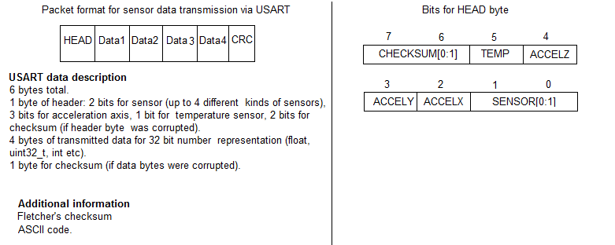

# UART packet for float number representation 

## Data packet description

UART packet for float number representation is shown on the figure below. 



6 bytes total. 
1 byte of header: 2 bits for sensor (up to 4 different kinds of sensors), 3 bits for acceleration axis, 1 bit for temperature sensor, 2 bits for checksum (if header byte was corrupted).
4 bytes of transmitted data for 32 bit number representation (float, uint32_t, int etc). 
1 byte for checksum (if data bytes were corrupted).

##  Bits for HEAD file 

**SENSOR[0:1]**: Sensor. 

These bits represent sensor that measured and sent data. 

00: Temperature sensor 

01: Accelerometer

You can also determine 10 and 11 in order to extend measuring system, so you need to add one more HEAD byte. 

**ACCELX**, **ACCELY**, **ACCELZ**: Acceleration along X, Y or Z axis. 

These bits for getting if acceleration was measured along X, Y or Z axis. 

**TEMP**: Temperature sensor. 

This bit should be set when you set SENSOR = 01. 

**CHECKSUM[0:1]**: Checksum for getting if header byte was not corrupted. 

There are 6 bits of header byte data (64 possible number), CHECKSUM[0:1] can contain up to 4 possible numbers. 
So in order to get if 6 bits of header data were not corrupted, use Fletcher's checksum: add together all 6 bits, divide them by 8 and keep only remainder. 

<!--
## Code implementation 

```C

```
-->
