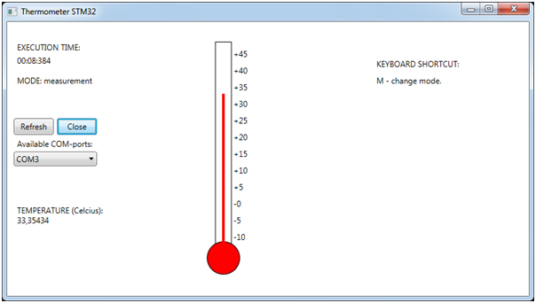

# Thermometer-SerialPort-WPF 

`Thermometer-SerialPort-WPF` is a WPF application written in C# that receives temperature data from a microcontroller via serial port, and displays the data as a thermometer.

## Overall description

This project allows you to get temperature from microcontroller via serial port and display it.



### Goal

The goal of the project is to create a system that can receive data from a microcontroller via serial port and display temperature and relative acceleration in a user-friendly interface.

### Scope

The scope of the project includes developing a WPF application in C# that can receive and display data from a microcontroller, setting a delay for data transmission to prevent the application from hanging, and configuring the COM port settings within the code.

### Who can use this project

This project can be used by engineers, researchers, or hobbyists who are interested in visualizing temperature data from a microcontroller.

## How to use 

### Prerequisites

- Windows OS; 
- .NET Core 3.1; 
- Any text editor (*VS Code*, *Sublime Text*, *Notepad++* etc) or Visual Studio; 
- Windows command line (if you do not use Visual Studio). 

Dependencies for this application: 
- System.IO.Ports (Version 4.4.0). 

### COM-port configuration

For the program to work correctly, it is critical to **set a delay** for *data transmission* from the microcontroller to the computer so that `Thermometer` does not hang.
Because when there is a constant stream of data, at best, `Thermometer` stops responding to anything, but most often it just crashes with an **APPCRASH** exception.

**COM-port configuration** (parity, number of stop bits, number of data bits, baud rate) is made in the code itself depending on technical requirements.
Click [here](Docs/DataTransmission.md) to read full information on how to configure data transmission in this application. 

### How to download this repository and edit code 

In order to download this repository, just type into console the following command: 
```
git clone https://github.com/alexeysp11/Thermometer-SerialPort-WPF
```

Then just open main directory using any text editor and just edit code. 

In order to open `Thermometer` application with Visual Studio, just open `Thermometer.sln` solution by double click. 

### How to run 

If you are not using Visual Studio, you can run `Thermometer` using *Windows command line*. 
So just write the following command into console: 
```
run.cmd
```
